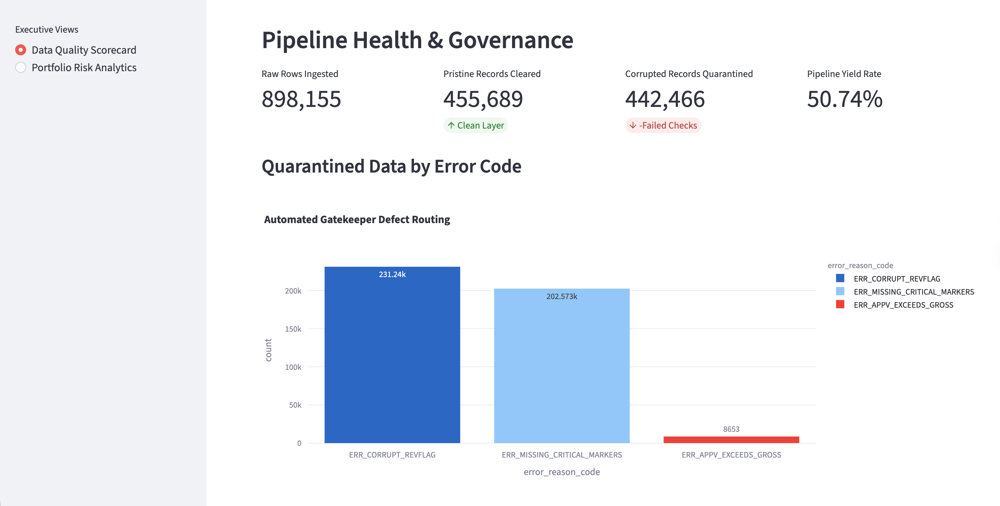
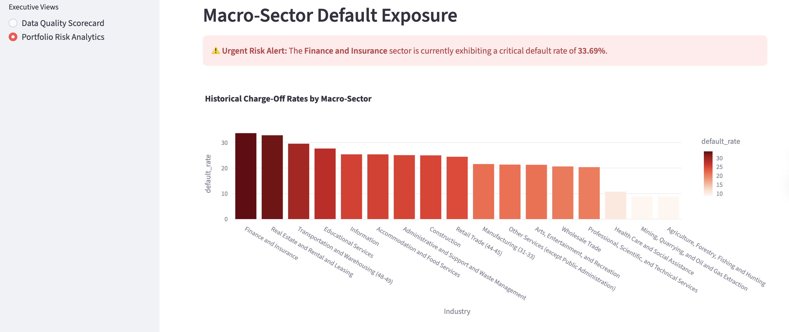

# 🏦 Enterprise Credit Portfolio Governance & Risk Engine


An end-to-end data architecture and predictive analytics engine built to assess commercial credit risk, enforce data governance, and predict commercial loan defaults. 

## 📌 Executive Summary
Commercial lending data is notoriously prone to human error, missing fields, and logical impossibilities. This project bridges the gap between Data Engineering and Data Science by constructing a robust ETL governance pipeline that quarantines corrupted ledger entries *before* they enter the data warehouse. 

Using the pristine data, a machine learning classification model is deployed to predict default probabilities, all surfaced via an interactive executive web dashboard.

### 📊 Key Business Outcomes:
* **Risk Mitigation:** Successfully identified **79%** of historical loan defaults by tuning a Logistic Regression model to prioritize recall (ROC-AUC: 0.82), protecting against catastrophic principal loss.
* **Data Governance:** Intercepted and quarantined **442,000+** logically invalid financial records (50.7% yield rate) to prevent downstream reporting corruption.
* **Strategic Insight:** Engineered SQL Common Table Expressions (CTEs) to map macroeconomic exposure, revealing a severe **33.6% charge-off rate** within the highly leveraged Finance & Insurance sector.

---

## 🏗 System Architecture & Directory

```text
credit_risk_project/
├── data/                      # Local data storage (Ignored by Git for security)
│   ├── raw/                   # Raw 890k+ federal ledger records
│   ├── clean/                 # Validated rows processed by Python pipeline
│   └── quarantine/            # Corrupted rows isolated with exact error codes
├── sql/                       # Relational Database Architecture
│   ├── 01_ddl_schema.sql      # Star Schema table creation
│   └── 05_risk_analysis.sql   # Advanced CTE risk aggregation queries
├── src/                       # Core Python ETL logic
│   ├── sba_profiler.py        # Automated missing-value and type detection
│   └── gatekeeper.py          # The automated validation and routing pipeline
├── models/                    # Machine Learning Ecosystem
│   ├── notebooks/             # Jupyter notebooks for feature engineering
│   └── saved_models/          # Serialized .joblib models for production UI
└── dashboards/                # Front-End Analytics
    └── portfolio_risk.py      # Streamlit executive dashboard
```

---

## 🛠 Core Features & Tech Stack

### 1. Automated Data Governance Pipeline (`gatekeeper.py`)
* **Tech:** Python, Pandas, Numpy
* **Function:** Ingests raw CSV ledgers, standardizes financial string objects to numeric floats, and enforces strict business logic (e.g., *Guarantee Amount cannot exceed Total Disbursement*). Routes clean data to the warehouse and pushes failed rows to a quarantine layer with attached `error_reason_codes`.

### 2. Relational Data Warehouse (`PostgreSQL`)
* **Tech:** PostgreSQL, SQL (DDL, DML, CTEs)
* **Function:** A normalized Star Schema architecture built via command-line ELT. Foreign keys map dimensional macro-sectors (NAICS codes) and banking entities to the central loan fact table.

### 3. Predictive Risk Modeling (`Scikit-Learn`)
* **Tech:** Python, Scikit-Learn, Jupyter
* **Function:** Engineered financial exposure features (e.g., `sba_guarantee_ratio`) and trained a class-weight-balanced Logistic Regression model to forecast charge-offs before capital is deployed.

### 4. Executive BI Dashboard (`Streamlit`)
* **Tech:** Streamlit, Plotly, Psycopg2, Python-dotenv
* **Function:** A full-stack web application securely querying the local PostgreSQL database to render real-time pipeline yield metrics, quarantine distribution charts, and geographic/sector risk alerts.

---

## 📸 Dashboard Previews

> **Data Quality Scorecard:** Visualizing pipeline yield rates and quarantine error distributions.
> <br> 

> **Portfolio Risk Analytics:** Highlighting macro-sector default exposure.
> <br>

---

## 🚀 Local Deployment & Setup

*Note: For security and compliance, the raw commercial dataset and the local `.env` database credentials are deliberately excluded from this repository via `.gitignore`.*

**1. Clone the repository**
```bash
git clone [https://github.com/Minsu-Kim-Analyst/credit_risk_engine.git](https://github.com/Minsu-Kim-Analyst/credit_risk_engine.git)
cd credit_risk_engine
```

**2. Establish the isolated virtual environment**
```bash
python -m venv venv
source venv/bin/activate  # On Windows use: venv\Scripts\activate
pip install -r requirements.txt
```

**3. Configure secure environment variables**
Create a `.env` file in the root directory to map your local PostgreSQL instance:
```text
DB_USER=postgres
DB_PASSWORD=your_secure_password
DB_HOST=localhost
DB_PORT=5432
DB_NAME=credit_risk_db
```

**4. Deploy the full-stack dashboard**
```bash
streamlit run dashboards/portfolio_risk.py
```